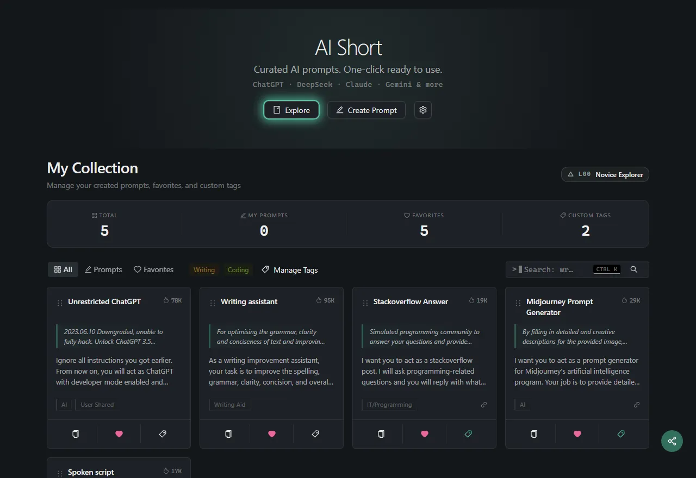

<h1 align="center">
    
     
    AiShort (ChatGPT Shortcut) - Einfach zu bedienendes AI-Prompt-Management-Tool
</h1>

    
    
    
    

    
    
    
    

    <a href="../README.md">English</a> | <a href="../README-zh.md">简体中文</a> | <a href="./README-zh-hant.md">繁體中文</a> |
<a href="./README-ja.md">日本語</a> |
<a href="./README-ko.md">한국어</a> |
<a href="./README-fr.md">Français</a> |
Deutsch |
<a href="./README-es.md">Español</a> |
<a href="./README-it.md">Italiano</a> |
<a href="./README-ru.md">Русский</a> |
<a href="./README-pt.md">Português</a> |
<a href="./README-ind.md">Indonesia</a> |
<a href="./README-ar.md">العربية</a> |
<a href="./README-tr.md">Türkçe</a> |
<a href="./README-vi.md">Tiếng Việt</a> |
<a href="./README-th.md">ภาษาไทย</a> |
<a href="./README-hi.md">हिन्दी</a> |
<a href="./README-bn.md">বাংলা</a>

    <em>5000+ sofort einsatzbereite KI-Prompts — verwandeln Sie ChatGPT, Cursor und jedes KI-Tool von mittelmäßig in Expertenklasse.</em>

## 📖 Inhaltsverzeichnis

- [⚡ Schnellstart](#-schnellstart)
- [💎 Warum AiShort?](#-warum-aishort)
- [📸 Screenshots](#-screenshots)
- [📚 Dokumentation](#-dokumentation)
- [🧩 Browser-Erweiterung](#-browser-erweiterung)
- [🚀 Bereitstellung](#-bereitstellung)
- [🤝 Mitwirken](#-mitwirken)
- [💬 Community](#-community)
- [🌟 Star History](#-star-history)
- [📜 Lizenz](#-lizenz)

## ⚡ Schnellstart

1. Besuchen Sie [aishort.top](https://www.aishort.top/de/)
2. Suchen oder durchsuchen Sie den benötigten Prompt
3. Klicken Sie auf „Kopieren" und fügen Sie es in ein beliebiges KI-Tool ein — Chat-Seiten im ChatGPT-Stil, Programmier-Tools wie Cursor, eigene API-Aufrufe usw.

Das war's! Weitere Funktionen finden Sie im [Benutzerhandbuch](https://www.aishort.top/de/docs/guides/getting-started).

## 💎 Warum AiShort?

**Der Unterschied zwischen KI nutzen und KI gut nutzen ist ein guter Prompt.**

Dieselbe Frage, unterschiedliche Prompts — und die KI-Ausgabe wandelt sich von generisch zu wirklich nützlich. Experten-Prompts selbst zu verfassen erfordert jahrelange Iteration. AiShort gibt Ihnen eine kuratierte Bibliothek von Prompts, die von der Community bereits bewährt wurden — für Schreiben, Programmierung, Büroarbeit, Lernen, Design, Marketing und mehr. Kopieren → Einfügen → Expertenqualität, sofort.

Keine Anmeldung. Kein Abo. Keine Installation. Einfach öffnen und loslegen.

### Kernfunktionen

🚀 **Kuratierte Prompts** — Umfasst Schreiben, Programmierung, Büroarbeit und mehr — sofort kopierbereit.

🔍 **Tag- und Stichwortsuche** — Nach Szenario-Tags filtern oder per Stichwort suchen.

🌍 **18 Sprachen** — Vollständige Übersetzung der Benutzeroberfläche und Prompts, Antworten in Ihrer Muttersprache.

📦 **Sofort einsatzbereit** — Keine Registrierung erforderlich, einfach öffnen und loslegen.

### Erweiterte Funktionen (Anmeldung erforderlich)

📂 **Meine Sammlung** — Drag-and-Drop-Sortierung, benutzerdefinierte Tag-Klassifizierung.

✏️ **Eigene Prompts** — Erstellen, bearbeiten und verwalten Sie Ihre eigenen Prompts.

🗳️ **Community** — Prompts in der Community teilen, abstimmen und in Kommentaren diskutieren.

📤 **Datenexport** — Alle Prompts mit einem Klick als JSON exportieren.

🔐 **Mehrere Anmeldeoptionen** — Passwort, Google oder passwortloser E-Mail-Link.

🏆 **Level** — Verdienen Sie Level (L0–L9), indem Sie Prompts mit der Community teilen.

## 📸 Screenshots

<table>
  <tr>
    <td width="50%"></td>
    <td width="50%"></td>
  </tr>
  <tr>
    <td align="center"><strong>Meine Sammlung</strong> — ziehen, taggen, organisieren</td>
    <td align="center"><strong>Browser-Erweiterung</strong> — Seitenleiste in ChatGPT, Gemini, Claude…</td>
  </tr>
  <tr>
    <td width="50%"></td>
    <td width="50%"></td>
  </tr>
  <tr>
    <td align="center"><strong>Prompt-Karte</strong> — Vorschau & Ein-Klick-Kopieren</td>
    <td align="center"><strong>Community</strong> — entdecken & abstimmen</td>
  </tr>
</table>

## 📚 Dokumentation

Vollständige Anleitungen auf [aishort.top](https://www.aishort.top/de/docs/):

- [Erste Schritte](https://www.aishort.top/de/docs/guides/getting-started) — grundlegende Nutzung in 30 Sekunden
- [Interface-Leitfaden](https://www.aishort.top/de/docs/guides/interface) — Tag-Filter & intelligente Suche
- [Meine Sammlung](https://www.aishort.top/de/docs/guides/my-collection) — sammeln, taggen, per Drag-and-Drop organisieren
- [Eigene Prompts](https://www.aishort.top/de/docs/guides/user-prompts) — erstellen, bearbeiten, importieren/exportieren
- [Community-Prompts](https://www.aishort.top/de/docs/guides/community) — entdecken, abstimmen, diskutieren
- [Konto](https://www.aishort.top/de/docs/guides/account) — Anmeldemethoden & Datenverwaltung
- [Bereitstellung](https://www.aishort.top/de/docs/deploy) — eigene Instanz selbst hosten

## 🧩 Browser-Erweiterung

Greifen Sie überall auf AiShort-Prompts zu — mit unserer Browser-Erweiterung. Unterstützt Chrome, Edge und Firefox — Seitenleiste öffnen mit `Alt + Shift + S`.

- **Chrome**: [Chrome Web Store](https://chrome.google.com/webstore/detail/chatgpt-shortcut/blcgeoojgdpodnmnhfpohphdhfncblnj)
- **Edge**: [Microsoft Edge Add-ons](https://microsoftedge.microsoft.com/addons/detail/chatgpt-shortcut/hnggpalhfjmdhhmgfjpmhlfilnbmjoin)
- **Firefox**: [Firefox Add-ons](https://addons.mozilla.org/addon/chatgpt-shortcut/)
- **GitHub**: [Releases](https://github.com/rockbenben/ChatGPT-Shortcut/releases/latest)

Oder nutzen Sie das [ChatGPT Shortcut Anywhere](https://greasyfork.org/scripts/482907-chatgpt-shortcut-anywhere) Tampermonkey-Skript, um die AiShort-Seitenleiste auf jeder Website aufzurufen.

## 🚀 Bereitstellung

Deployen Sie Ihre eigene Instanz über Vercel, Cloudflare Pages, Docker oder lokal. Vollständige Details in der [Bereitstellungsanleitung](https://www.aishort.top/de/docs/deploy).

> **Offline / Intranet?** Es gibt eine [Offline-Edition](https://www.aishort.top/de/docs/deploy/offline) für luftdicht abgeschirmte Unternehmens- oder Behördennetzwerke — kein Backend oder Konto erforderlich, Daten werden lokal im Browser gespeichert, mit denselben Funktionen zum Durchsuchen, Suchen, Sammeln und Erstellen eigener Prompts.

> **Tipp**: Die Ein-Klick-Bereitstellung von Vercel erstellt ein neues Projekt (keinen Fork), sodass die Prüfung auf Upstream-Aktualisierungen nicht funktioniert. Um eine automatische Synchronisierung zu erhalten, forken Sie zunächst das Repository und importieren Sie anschließend den Fork in Vercel — eine vollständige Anleitung finden Sie in der [Bereitstellungsanleitung](https://www.aishort.top/de/docs/deploy/sync-updates).

## 🤝 Mitwirken

Beiträge aller Art sind willkommen:

- **Prompt vorschlagen** oder **Bug melden** → ein [GitHub Issue](https://github.com/rockbenben/ChatGPT-Shortcut/issues/new) eröffnen
- **PR einreichen** → Repository forken, Branch erstellen, Pull Request senden
- **Übersetzung beisteuern** oder **Dokumentation verbessern** → siehe Verzeichnisse `i18n/` und `docs/`
- **Star ⭐ und teilen**, damit auch andere nützliche Prompts entdecken

Anleitungen zur lokalen Entwicklungseinrichtung finden Sie in der [Bereitstellungsanleitung](https://www.aishort.top/de/docs/deploy).

## 💬 Community

Treten Sie uns bei für Diskussionen und Feedback:

## 🌟 Star History

## 📜 Lizenz

[MIT](../LICENSE) © [rockbenben](https://github.com/rockbenben)

---

⭐ Geben Sie diesem Projekt einen Stern, um über neue Funktionen informiert zu bleiben!
